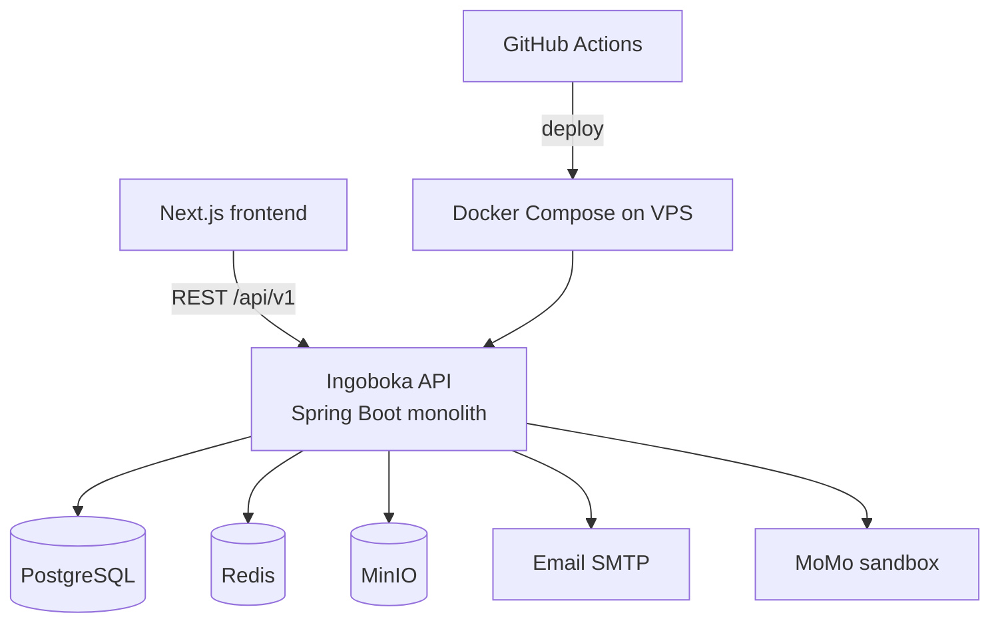

# Ingoboka API v1

Enterprise **B2B2C digital insurance platform** API for Rwanda — citizens enroll in micro-insurance products, insurers manage catalogs and claims, agents assist enrollments, and platform admins onboard partners.

Built with **Java 21**, **Spring Boot 4**, **PostgreSQL**, **Redis**, and **MinIO**. Designed to power the Ingoboka Next.js frontend and hackathon/demo deployments.

| | |
|---|---|
| **Base URL (local Docker)** | `http://localhost:8085/api/v1` |
| **Base URL (remote demo)** | `http://185.181.10.165:8085/api/v1` |
| **Swagger UI (Docker)** | `http://localhost:8085/swagger-ui/index.html` |
| **Health** | `GET /actuator/health` |

---

## Table of contents

- [Architecture](#architecture)
- [Features](#features)
- [Tech stack](#tech-stack)
- [Quick start](#quick-start)
- [Demo credentials](#demo-credentials)
- [Configuration](#configuration)
- [API overview](#api-overview)
- [Project structure](#project-structure)
- [Testing](#testing)
- [CI/CD](#cicd)
- [Documentation](#documentation)

---

## Architecture

### System overview



Full diagrams:

- [System architecture](docs/architecture/system-architecture.md) — layers, Docker runtime, security
- [Services flow](docs/architecture/services-flow.md) — citizen / insurer / agent journeys
- [Test flow](docs/architecture/test-flow.md) — CI pipeline and integration tests

---

## Features

| Domain | Capabilities |
|--------|----------------|
| **Identity** | Citizen registration, email OTP, JWT + refresh tokens, RBAC, staff provisioning |
| **Partners** | Insurer onboarding, contracts, staff roles, org settings |
| **Catalog** | Products, plans (daily/weekly/monthly), benefits, exclusions, FAQ, hero images, PDF documents |
| **Enrollment** | Quotes, applications, needs assessment with product recommendations, agent-assisted flow |
| **Policies** | Issuance, wallet, QR verification, activity feed, lifecycle (grace / lapse) |
| **Claims** | Submit, status timeline, insurer decision workflow |
| **Billing** | Premium payments, MoMo sandbox, reconciliation |
| **Reporting** | Tenant overview, claims breakdown, policy summary (`citizensEnrolled`) |
| **Platform** | Admin dashboard, audit logs, document storage |

**Frontend compatibility** — `FrontendCompatController` exposes alias routes expected by the Next.js MVP (`/customers/me`, `/policies`, `/agent/applications`, etc.).

---

## Tech stack

| Layer | Technology |
|-------|------------|
| Language | Java 21 |
| Framework | Spring Boot 4.1 (Web, Security, JPA, Mail, Actuator) |
| Database | PostgreSQL 16 + Flyway migrations |
| Cache / OTP | Redis 7 |
| Object storage | MinIO (S3-compatible) |
| Auth | JWT (jjwt) + BCrypt |
| API docs | springdoc-openapi 2.x |
| Tests | JUnit 5, MockMvc, Testcontainers |
| Build | Maven Wrapper |
| Deploy | Docker multi-stage build + Compose |

---

## Quick start

### Prerequisites

- **Java 21** (JDK)
- **Docker Desktop** (for full stack and integration tests)
- **Git**

### Run with Docker (recommended)

1. Copy environment file and set secrets:

```bash
cp deploy/.env.example deploy/.env
# Edit deploy/.env — set JWT_SECRET, MAIL_USERNAME, MAIL_PASSWORD at minimum
```

2. Start the stack:

```bash
cd deploy
docker compose up -d --build
```

3. Verify:

```bash
curl http://localhost:8085/actuator/health
# Open Swagger: http://localhost:8085/swagger-ui/index.html
```

The API runs on **port 8085** (mapped from container 8080). On first start, Flyway migrates the DB and seeders create the platform admin + demo dataset (`docker` profile).

### Run locally with Maven (dev)

Requires local PostgreSQL and Redis, or adjust `application.properties`:

```bash
./mvnw spring-boot:run
# API on http://localhost:8080
```

### Build JAR

```bash
./mvnw clean package -DskipTests
java -jar target/v1-0.0.1-SNAPSHOT.jar
```

---

## Demo credentials

Available after `docker compose up` with `DemoDataSeeder` (password for all: **`Ingoboka@2026`**).

| Role | Login |
|------|-------|
| Citizen | `+250780000001` |
| Partner admin | `eric@demo-insurer.rw` |
| Claims officer | `claims@demo-insurer.rw` |
| Agent | `agent@demo-insurer.rw` |
| Platform admin | `PLATFORM_ADMIN_EMAIL` / `PLATFORM_ADMIN_PASSWORD` in `deploy/.env` (seeded once) |

Demo includes a published **Personal Accident Micro** product (daily/weekly/monthly plans), an active policy, and a sample claim.

---

## Configuration

Key environment variables (see `deploy/.env` and `application-docker.properties`):

| Variable | Description | Default |
|----------|-------------|---------|
| `JWT_SECRET` | JWT signing key (≥256 bits) | **required in prod** |
| `PLATFORM_ADMIN_EMAIL` / `PLATFORM_ADMIN_PASSWORD` | First-run platform admin seed | see `.env.example` |
| `OTP_DELIVERY_CHANNEL` | `email` \| `log` \| `sms` | `email` |
| `MAIL_HOST` / `MAIL_USERNAME` / `MAIL_PASSWORD` | SMTP for OTP & notifications | Gmail-compatible |
| `SANDBOX_AUTO_APPROVE` | Auto-approve applications in demo | `true` |
| `SEED_DEMO_DATA` | Runtime demo seed (`docker` profile) | `true` |
| `CORS_ALLOWED_ORIGINS` | Frontend origin(s) | `*` |
| `API_PORT` | Host port for API | `8085` |

**OTP modes**

- **Production / remote demo:** `OTP_DELIVERY_CHANNEL=email` + real SMTP
- **Local dev:** `OTP_DELIVERY_CHANNEL=log` — OTP appears in API logs

---

## API overview

All responses use a standard envelope:

```json
{
  "success": true,
  "message": "…",
  "data": { },
  "timestamp": "2026-06-20T12:00:00Z"
}
```

Authenticated routes require `Authorization: Bearer <accessToken>`.

### Public routes (sample)

| Method | Path | Description |
|--------|------|-------------|
| GET | `/auth/otp-delivery-config` | OTP channel for frontend |
| POST | `/auth/register` | Citizen signup |
| POST | `/auth/login` | Phone or email login |
| POST | `/auth/verify-otp` | Verify signup OTP → tokens |
| GET | `/products` | Published product catalog |
| GET | `/products/{id}/detail` | Plans, FAQ, documents, hero image |
| GET | `/verify/{token}` | Public policy card verification |

### Role-specific routes (sample)

| Role | Examples |
|------|----------|
| Citizen | `/policies/me`, `/claims/me`, `/applications/quote` |
| Agent | `/agent/applications` |
| Insurer | `/products/tenant`, `/admin/claims`, `/reports/policies/summary` |
| Platform admin | `/partners`, `/admin/platform/overview` |

Interactive documentation: **Swagger UI** at `/swagger-ui/index.html`.

---

## Project structure

```
ingoboka-api/
├── src/main/java/com/ingoboka_api/v1/
│   ├── identity/          # Auth, users, orgs, seeders
│   ├── customer/          # Citizen profiles, consent, dependants
│   ├── partner/           # Insurer onboarding, staff, settings
│   ├── product/           # Catalog, plans, FAQ, documents
│   ├── enrollment/        # Quotes, applications, needs assessment
│   ├── policy/            # Policies, verification, lifecycle
│   ├── claim/             # Claims, decisions, status history
│   ├── billing/           # Payments, bills, MoMo adapter
│   ├── reporting/         # Dashboards, exports
│   ├── frontend/          # Next.js compatibility aliases
│   ├── document/          # MinIO storage
│   ├── messaging/         # Email templates, notifications
│   └── common/            # Security, config, DTOs, exceptions
├── src/main/resources/
│   ├── db/migration/      # Flyway SQL (V1–V19+)
│   └── application*.properties
├── src/test/java/         # Unit + integration tests
├── deploy/                # docker-compose.yml, .env
├── docs/                  # Architecture, Rodin briefs
├── Dockerfile
└── .github/workflows/     # CI/CD
```

---

## Testing

```bash
# Unit tests only
./mvnw clean test

# Full verify (integration tests when Docker is available)
./mvnw clean verify -B -Dintegration=true
```

| Suite | Count | Notes |
|-------|-------|-------|
| Unit | 1 | Application context smoke test |
| Integration | 30 | Gated by `-Dintegration=true`; uses Testcontainers |

See [Test flow diagram](docs/architecture/test-flow.md) for CI gates and troubleshooting.

---

## CI/CD

On every **push/PR to `main`**:

1. `build-and-test` — `./mvnw clean verify -B -Dintegration=true`
2. On **push to main** — Docker image build
3. **Deploy** — Bundle copied to VPS via SCP; `docker compose up -d --build`

Required GitHub secrets: `SERVER_HOST`, `SERVER_USERNAME`, `SERVER_SSH_KEY`, `SERVER_SSH_PASSPHRASE`.

---

## Documentation

| Document | Purpose |
|----------|---------|
| [docs/architecture/system-architecture.md](docs/architecture/system-architecture.md) | System & deployment architecture |
| [docs/architecture/services-flow.md](docs/architecture/services-flow.md) | Business and service interaction flows |
| [docs/architecture/test-flow.md](docs/architecture/test-flow.md) | Test and CI pipeline |
| [docs/RODIN_BACKEND_FOR_100_PERCENT_FRONTEND.md](docs/RODIN_BACKEND_FOR_100_PERCENT_FRONTEND.md) | Frontend integration brief |
| [docs/RODIN_REMAINING_FOR_100_PERCENT.md](docs/RODIN_REMAINING_FOR_100_PERCENT.md) | Remaining polish checklist |

---

## License

Proprietary — Ingoboka platform team. Contact maintainers for usage terms.
