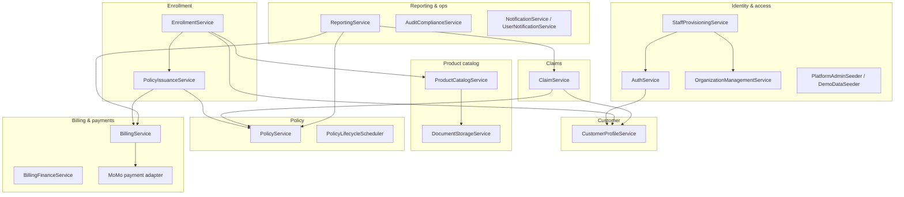
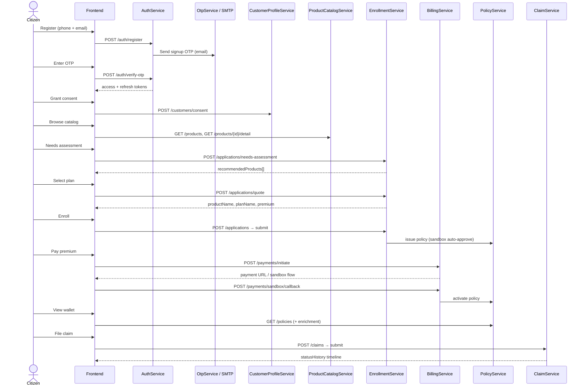
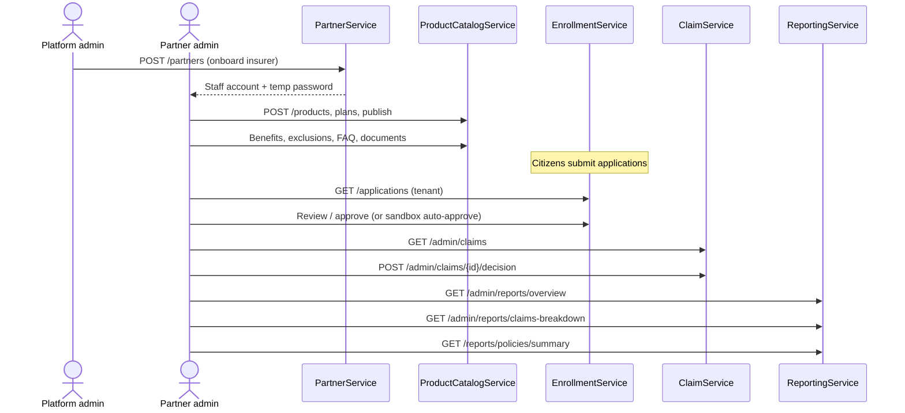
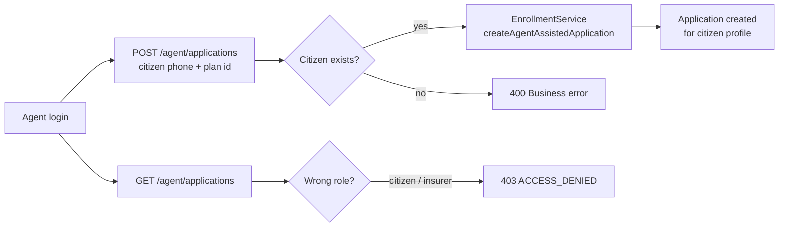
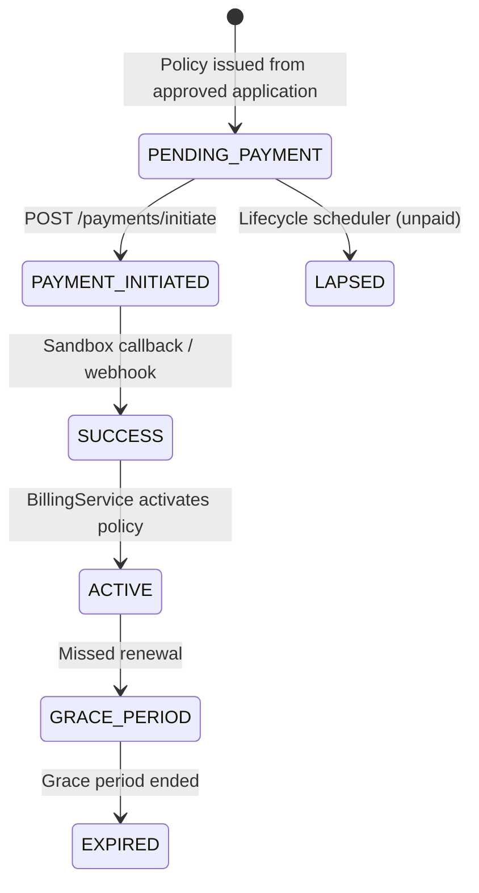

# Ingoboka API — Services Flow

Domain service interactions and end-to-end business journeys.

## Service map

## Citizen journey — register to claim

## Insurer / partner journey

## Agent assisted enrollment

## Payment flow (sandbox)

## Frontend compatibility layer

The Next.js MVP calls a mix of canonical and alias routes. `FrontendCompatController` maps frontend-expected paths to domain services without duplicating business logic.

| Frontend area | Alias examples | Backing service |
|---------------|----------------|-----------------|
| Customer | `/customers/me`, `/customer/dependants` | CustomerProfileService |
| Enrollment | `/applications` shortcut | EnrollmentService |
| Policies | `/policies`, `/policies/me/activity` | PolicyService |
| Claims | `/claims/me`, `/admin/claims` | ClaimService |
| Payments | `/payments/initiate` | BillingService |
| Reports | `/admin/reports/overview`, `/admin/reports/claims-breakdown` | ReportingService, ClaimService |
| Agent | `/agent/applications` | EnrollmentService |

## Scheduled jobs

| Job | Schedule | Service |
|-----|----------|---------|
| Policy lifecycle | Daily 02:00 UTC (`ingoboka.policy.lifecycle.cron`) | `PolicyLifecycleScheduler` — grace period, lapse, expiry |
