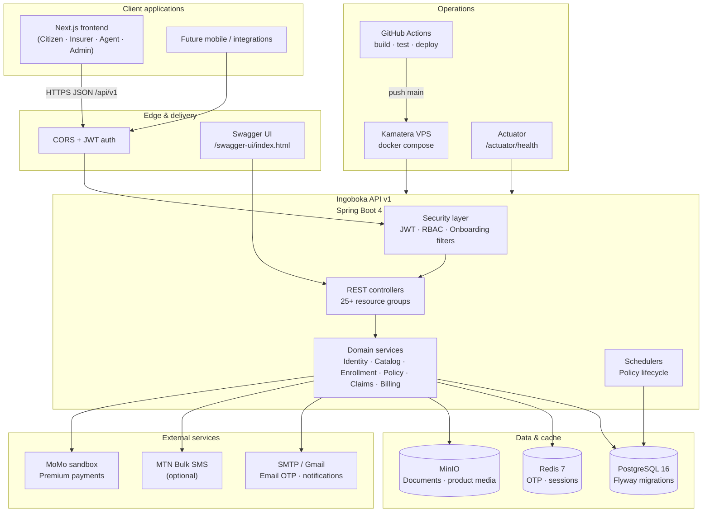
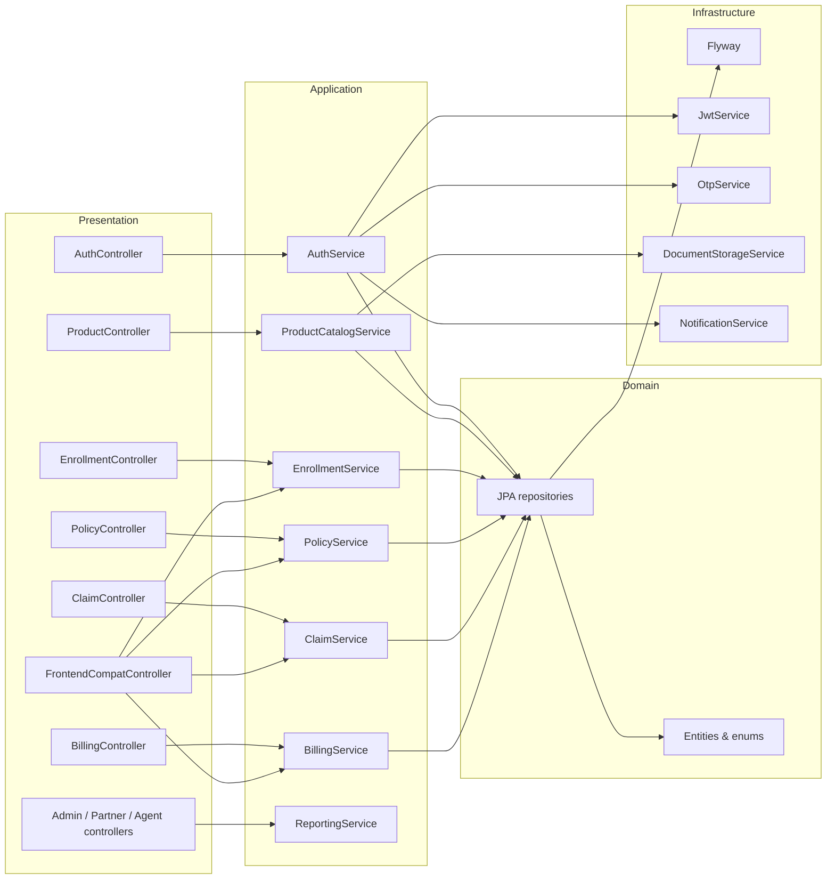
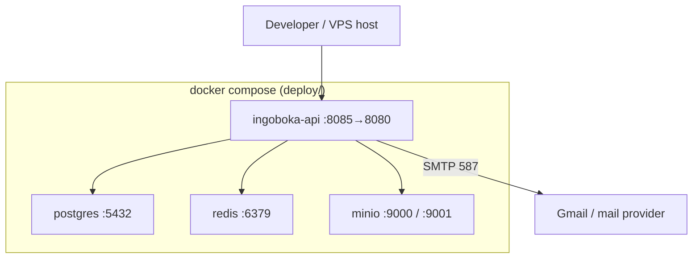

# Ingoboka API — System Architecture

High-level view of the platform, infrastructure, and deployment topology.

## Context diagram

## Application layers

## Docker runtime (local / production)

## Security model

| Layer | Mechanism |
|-------|-----------|
| Transport | HTTPS in production; CORS configurable per origin |
| Authentication | JWT access token (30 min) + refresh token (7 days, hashed in DB) |
| Authorization | Role-based (`@PreAuthorize`) — `CITIZEN`, `AGENT`, `PARTNER_ADMIN`, `CLAIMS_OFFICER`, `PLATFORM_ADMIN`, … |
| OTP | Email (default), SMS (MTN), or log mode for dev |
| Staff onboarding | Temporary password + email verification gates (`OnboardingAccessFilter`) |
| Documents | MinIO presigned URLs; access classification on policy/claim docs |

## Key technology choices

| Component | Choice |
|-----------|--------|
| Runtime | Java 21, Spring Boot 4.1 |
| API | REST, JSON wrapper `{ success, message, data }` |
| Persistence | PostgreSQL + Hibernate validate + Flyway |
| Cache / OTP | Redis (or in-memory in test profile) |
| Object storage | MinIO (S3-compatible) |
| API docs | springdoc-openapi / Swagger UI |
| Tests | JUnit 5, MockMvc, Testcontainers |
| Packaging | Multi-stage Docker image (Temurin 21) |

## Related docs

- [Services flow](./services-flow.md) — business journeys and service interactions
- [Test flow](./test-flow.md) — CI and integration test pipeline
- [README](../../README.md) — setup and operations
