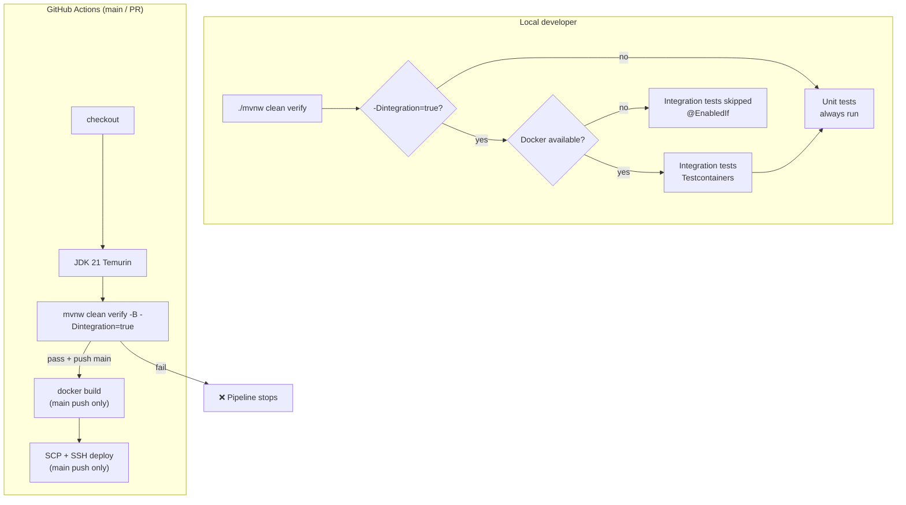
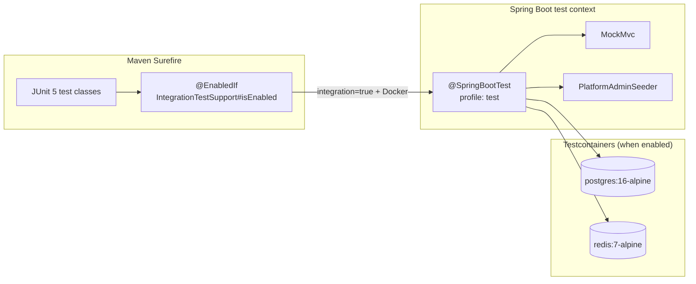
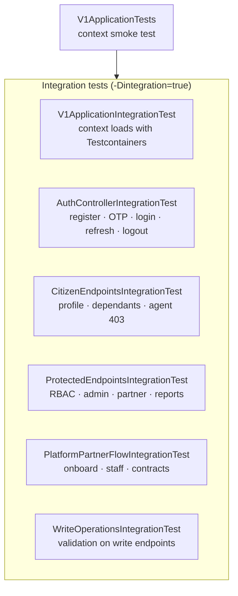
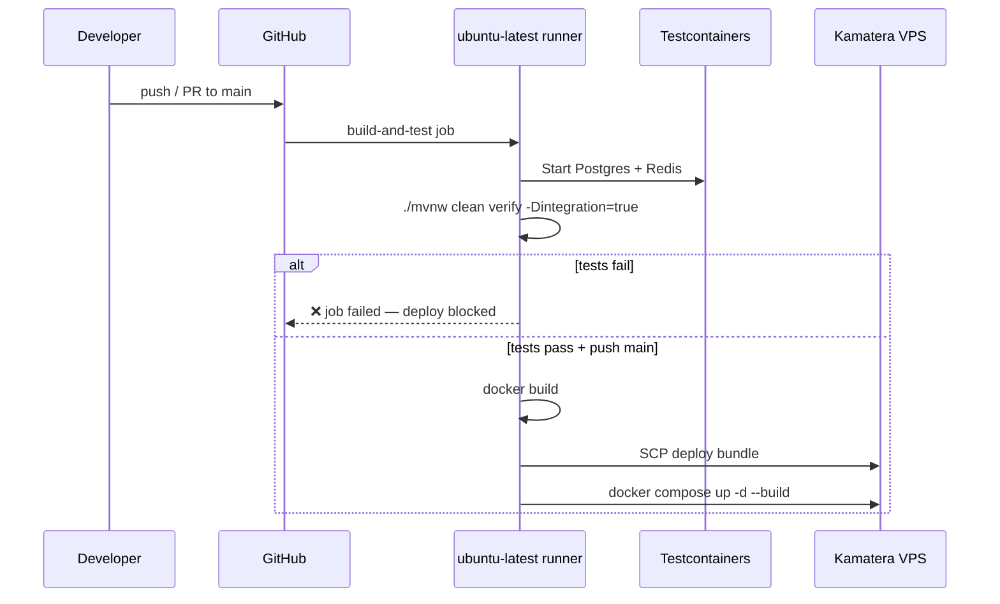

# Ingoboka API — Test Flow

How tests are structured, executed locally, and run in CI/CD.

## Pipeline overview



## Integration test architecture



## Test suite map



## Test class responsibilities

| Test class | Order / scope | What it verifies |
|------------|---------------|------------------|
| `V1ApplicationTests` | Unit | Spring application context starts |
| `V1ApplicationIntegrationTest` | Integration | Full stack + Flyway migrations against Testcontainers Postgres |
| `AuthControllerIntegrationTest` | Integration | Public OTP config; citizen register→verify→login; admin login; refresh/logout |
| `CitizenEndpointsIntegrationTest` | Integration | Citizen profile routes; citizen blocked from `/agent/applications` (403) |
| `ProtectedEndpointsIntegrationTest` | Integration | 401 without token; platform admin can reach dashboards, partners, reports, Swagger |
| `PlatformPartnerFlowIntegrationTest` | Ordered | Partner onboard → login → staff → contracts |
| `WriteOperationsIntegrationTest` | Integration | Write endpoints return 4xx (not 5xx) on empty payloads |

## Integration test support

`IntegrationTestSupport` provides:

- **Testcontainers** — PostgreSQL 16 + Redis 7 (when Docker is available)
- **Dynamic properties** — JDBC and Redis URLs wired at runtime
- **MockMvc helpers** — `get`, `post`, `loginPlatformAdmin`, etc.
- **Security isolation** — `SecurityContextHolder.clearContext()` before/after each test
- **Opt-out** — `-Dintegration=true` required; without Docker, tests are skipped (not failed)

### Local commands

```bash
# Unit tests only (no Docker required)
./mvnw clean test

# Full verify — integration tests run when Docker is available
./mvnw clean verify -B -Dintegration=true

# Force integration with local Postgres/Redis instead of Testcontainers
./mvnw clean verify -B -Dintegration=true -Dintegration.local=true
```

### Test profile (`application-test.properties`)

| Setting | Value | Purpose |
|---------|-------|---------|
| OTP storage | `memory` | No Redis dependency for OTP in tests |
| OTP delivery | `log` | OTP printed in logs; no SMTP |
| MinIO | disabled | Document storage not required |
| Platform admin seed | `platform-admin@test.ingoboka` | Predictable CI credentials |
| Demo seed | disabled | Isolated test data |

## CI/CD test gate



## Common failure modes (fixed / watch)

| Symptom | Cause | Fix |
|---------|-------|-----|
| `UnsatisfiedDependency: ObjectMapper` | `@Autowired ObjectMapper` in test base | Use `new ObjectMapper()` in `IntegrationTestSupport` |
| Refresh token 400 after login | `login()` was `@Transactional(readOnly=true)` | Persist refresh tokens in read-write transaction |
| 403 instead of 401 on unauth | Leaked `SecurityContext` between MockMvc calls | Clear context in `@BeforeEach` / `@AfterEach` |
| Integration tests skipped locally | No Docker Desktop | Start Docker or rely on CI |

## Pre-push checklist

```bash
chmod +x mvnw   # required on Linux / CI
./mvnw clean verify -B -Dintegration=true
```

All 31 tests should pass (0 failures) on GitHub Actions with Docker available.
