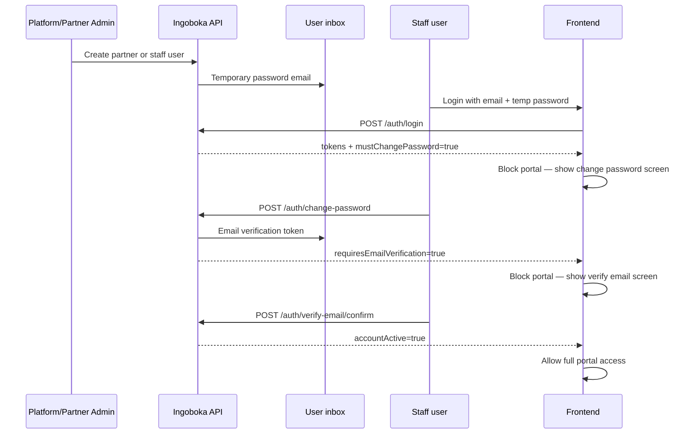

# Frontend guide — users, onboarding & portals

**Audience:** Next.js frontend team  
**Backend base URL:** `/api/v1`  
**Date:** June 2026

This document covers how the frontend should integrate:

1. **Citizen self-registration** (only public signup path)
2. **Platform admin user management**
3. **Partner / insurer staff onboarding** (admin-provisioned, forced password change, email verification)
4. **Partner product catalog** → citizen purchase flow

---

## 1. Who can register publicly?

| User type | How they join |
|-----------|----------------|
| **Citizen (customer)** | `POST /api/v1/auth/register` only |
| **Partner / insurer staff** | Created by **platform admin** or **partner admin** — no public signup |
| **Platform admin** | Created by existing platform admin via `/api/v1/admin/users` |

`POST /api/v1/auth/signup` is **disabled** and returns an error directing citizens to `/auth/register`.

---

## 2. Staff / partner onboarding flow (critical)

**One provisioning model for all admin-created accounts:** when the platform creates a **partner/insurer organization** (`POST /partners`) or when a **partner admin creates staff** (`POST /partners/{id}/staff` or `POST /partner/staff`), the backend uses the same `StaffProvisioningService` path:

| Step | What happens |
|------|----------------|
| 1 | Account created with a **temporary password** (provided in request or auto-generated) |
| 2 | Welcome email sent (`staff-welcome.txt`) with login URL + temporary password |
| 3 | User status → `PENDING_PASSWORD_CHANGE`, `mustChangePassword: true` |
| 4 | First login → forced **change password** → `PENDING_EMAIL_VERIFICATION` |
| 5 | **Verify email** → `ACTIVE`, full portal access |

This applies equally to:

- **Partner / insurer admin** created during `POST /partners` (`adminDefaultPassword`)
- **Staff members** created by platform admin or partner admin (`defaultPassword` on create-staff)

Citizens who self-register via `/auth/register` **do not** use this flow.



### Login response flags (`data.user`)

After `POST /api/v1/auth/login`, inspect:

| Field | Meaning | Frontend action |
|-------|---------|-----------------|
| `mustChangePassword` | Still using admin temporary password | Force `/change-password` route |
| `requiresEmailVerification` | Password changed but email not verified | Force `/verify-email` route |
| `accountActive` | Full portal access allowed | Route to dashboard |
| `status` | `PENDING_PASSWORD_CHANGE`, `PENDING_EMAIL_VERIFICATION`, `ACTIVE`, etc. | Display status banner |

**Example login response (staff, first login):**

```json
{
  "success": true,
  "data": {
    "accessToken": "...",
    "refreshToken": "...",
    "user": {
      "email": "admin@demo-insurer.rw",
      "role": "PARTNER_ADMIN",
      "status": "PENDING_PASSWORD_CHANGE",
      "mustChangePassword": true,
      "emailVerified": false,
      "requiresEmailVerification": true,
      "accountActive": false
    }
  }
}
```

### Step A — Change password (required)

```http
POST /api/v1/auth/change-password
Authorization: Bearer {accessToken}
```

```json
{
  "currentPassword": "TempFromEmail123",
  "newPassword": "MySecurePass@2026"
}
```

Returns new tokens. User is now `PENDING_EMAIL_VERIFICATION`.

### Step B — Verify email

Option 1 — token from email:

```http
POST /api/v1/auth/verify-email/confirm
```

```json
{ "token": "uuid-from-email" }
```

Option 2 — resend:

```http
POST /api/v1/auth/verify-email/request
```

```json
{ "email": "admin@demo-insurer.rw" }
```

After confirm → `status: ACTIVE`, `accountActive: true`.

### API guard (403)

If the user skips onboarding screens, protected APIs return:

```json
{
  "success": false,
  "code": "MUST_CHANGE_PASSWORD",
  "message": "You must change your temporary password first"
}
```

or

```json
{
  "success": false,
  "code": "EMAIL_VERIFICATION_REQUIRED",
  "message": "Verify your email address to activate your account"
}
```

**Allowed endpoints while onboarding:**

- Password change phase: `/auth/change-password`, `/auth/logout`, `/auth/refresh`
- Email verification phase: `/auth/verify-email/*`, `/auth/logout`, `/auth/refresh`

---

## 3. Platform admin — user CRUD

**Role required:** `PLATFORM_ADMIN`  
**Base path:** `/api/v1/admin/users`

| Method | Path | Purpose |
|--------|------|---------|
| GET | `/admin/users` | List all users (`?organizationId=&status=`) |
| GET | `/admin/users/{id}` | Get user |
| POST | `/admin/users` | Create staff/tenant user |
| PUT | `/admin/users/{id}` | Update profile |
| PATCH | `/admin/users/{id}/roles` | Set role |
| PATCH | `/admin/users/{id}/status` | ACTIVE / DISABLED / LOCKED |
| POST | `/admin/users/{id}/reset-password` | Email new temporary password |
| DELETE | `/admin/users/{id}` | Soft-disable user |

### Create partner organization + admin

```http
POST /api/v1/partners
```

```json
{
  "name": "Demo Insurer Ltd",
  "code": "DEMO_INSURER",
  "type": "INSURER",
  "adminFirstName": "Eric",
  "adminLastName": "Mugisha",
  "adminEmail": "eric@demo-insurer.rw",
  "adminPhone": "+250788000100",
  "adminDefaultPassword": "OptionalCustomTemp@123"
}
```

If `adminDefaultPassword` is omitted, the API generates one and emails it.

### Create platform or tenant user directly

```http
POST /api/v1/admin/users
```

```json
{
  "firstName": "Ops",
  "lastName": "Admin",
  "email": "ops@ingoboka.rw",
  "roleCode": "PLATFORM_ADMIN",
  "defaultPassword": "ChangeMe@2026"
}
```

For tenant roles (`PARTNER_ADMIN`, `CLAIMS_OFFICER`, etc.), include `organizationId`.

---

## 4. Partner admin — staff CRUD & oversight

**Role required:** `PARTNER_ADMIN` (own org) or `PLATFORM_ADMIN` (any org)

### 4a. Staff management (same onboarding as partner init)

Creating staff is **identical** to provisioning the partner admin at organization creation:

- Optional `defaultPassword` in the request; otherwise the API generates one
- Temporary password is **emailed** to the staff member
- Staff **must change password** before using the portal
- Staff **must verify email** before `accountActive` becomes true
- Partner admin can **reset credentials** at any time (re-starts password-change flow)

**Preferred base path (no `partnerId` in URL):** `/api/v1/partner/staff`  
Resolves the organization from the logged-in `PARTNER_ADMIN` JWT.

| Method | Path | Purpose |
|--------|------|---------|
| GET | `/partner/staff/overview` | Dashboard: staff list + onboarding status counts |
| GET | `/partner/staff` | List staff (`?page=&size=`) |
| GET | `/partner/staff/{userId}` | Get staff member |
| POST | `/partner/staff` | Create staff (emailed temp password) |
| PUT | `/partner/staff/{userId}` | Update name / email / phone / role |
| PATCH | `/partner/staff/{userId}/status` | Activate / disable / lock |
| POST | `/partner/staff/{userId}/reset-credentials` | Email new temporary password |
| DELETE | `/partner/staff/{userId}` | Disable staff |

**Alternate path (platform admin or explicit org id):** `/api/v1/partners/{partnerId}/staff`  
Same operations; use when the UI already has `partnerId` (e.g. platform admin managing any tenant).

### Staff overview response (`GET /partner/staff/overview`)

Use this on the partner admin dashboard to show who still needs onboarding:

```json
{
  "success": true,
  "data": {
    "totalStaff": 4,
    "pendingPasswordChange": 1,
    "pendingEmailVerification": 1,
    "activeStaff": 2,
    "disabledOrLocked": 0,
    "staff": [ /* StaffResponse[] */ ]
  }
}
```

Each `StaffResponse` includes `status`, `mustChangePassword`, `emailVerified`, and `roles` so the UI can badge users who have not finished onboarding.

### Create staff

```http
POST /api/v1/partner/staff
Authorization: Bearer {partnerAdminToken}
```

```json
{
  "firstName": "Claims",
  "lastName": "Officer",
  "email": "claims@demo-insurer.rw",
  "phoneNumber": "+250788000101",
  "roleCode": "CLAIMS_OFFICER",
  "defaultPassword": "OptionalTemp@123"
}
```

If `defaultPassword` is omitted, the API generates one and emails it — same behaviour as `adminDefaultPassword` on `POST /partners`.

### 4b. Partner admin — tenant operations (manage staff work)

`PARTNER_ADMIN` has **full visibility and control** over their organization's operational queues. Staff members (e.g. `CLAIMS_OFFICER`, `UNDERWRITER`) work items inside the tenant; the partner admin can always list, inspect, and act on the same data.

| Area | Endpoints | Partner admin can |
|------|-----------|-------------------|
| **Applications** | `GET /applications` | List all tenant applications (work queue) |
| | `GET /applications/{id}` | View any application in the org |
| | `PATCH /applications/{id}/review` | Approve / reject / move under review |
| **Claims** | `GET /claims` | List all tenant claims |
| | `GET /claims/{id}` | View any claim |
| | `PATCH /claims/{id}/status` | Update claim workflow (where permitted) |
| | `POST /claims/{id}/decision` | Record claim decisions |
| **Reports** | `GET /reports/overview` | Tenant KPIs |
| | `GET /reports/claims` | Claims analytics |
| **Products** | `GET /products/tenant` | List org products |
| | `POST /products`, publish endpoints | Manage catalog (also `INSURER_PRODUCT_MANAGER`) |
| **Customers** | `GET /admin/customers` | List customers linked to tenant policies |
| **Revenue** | `GET /revenue/*` | Financial summaries (with `FINANCE_OFFICER`) |

Frontend recommendation:

- **Partner admin dashboard** → `GET /partner/staff/overview` + `GET /applications?status=SUBMITTED` + `GET /claims?status=SUBMITTED`
- **Staff role dashboards** → same tenant endpoints, scoped by role (`CLAIMS_OFFICER` sees claims; `UNDERWRITER` sees applications)
- **Partner admin** always has a superset view and can intervene on any staff-handled item

---

## 5. Citizen registration (unchanged)

See also: [`frontend-auth-without-sms.md`](frontend-auth-without-sms.md)

```http
POST /api/v1/auth/register
```

```json
{
  "fullName": "Jean Uwimana",
  "phone": "+250780000001",
  "email": "jean@example.com",
  "nationalId": "1199880012345678",
  "password": "Ingoboka@2026"
}
```

Then `POST /api/v1/auth/verify-otp` with phone + code.

Citizens **never** go through `mustChangePassword` / staff email verification.

---

## 6. Partner portal — products → citizen purchase

### Partner creates products

**Roles:** `PARTNER_ADMIN`, `INSURER_PRODUCT_MANAGER`, `PLATFORM_ADMIN`  
**Org types:** `INSURER` or `PARTNER`

```http
POST /api/v1/products
```

```json
{
  "code": "PA-MICRO",
  "name": "Personal Accident Micro",
  "description": "Daily accident cover",
  "category": "PERSONAL_ACCIDENT"
}
```

```http
POST /api/v1/products/{productId}/plans
POST /api/v1/products/{productId}/publish
POST /api/v1/products/{productId}/plans/{planId}/publish
```

List tenant products: `GET /api/v1/products/tenant`

### Citizen browses & buys

```http
GET /api/v1/products
GET /api/v1/products/{productId}/plans
POST /api/v1/applications              { "productPlanId": "..." }
POST /api/v1/applications/{id}/submit
POST /api/v1/payments/initiate         { "applicationId": "..." }
POST /api/v1/payments/sandbox/callback
GET  /api/v1/policies
GET  /api/v1/policies/{id}/card
```

---

## 7. Frontend route guards (recommended)

```typescript
function resolvePostLoginRoute(user: AuthUser) {
  if (user.mustChangePassword) return "/onboarding/change-password";
  if (user.requiresEmailVerification) return "/onboarding/verify-email";
  if (!user.accountActive) return "/onboarding/pending";
  if (user.role === "CITIZEN") return "/customer/dashboard";
  if (user.role === "PARTNER_ADMIN") return "/partner/dashboard";
  if (user.role === "PLATFORM_ADMIN") return "/admin/dashboard";
  return "/dashboard";
}
```

On **every API 403**, check `code`:

- `MUST_CHANGE_PASSWORD` → redirect to change password
- `EMAIL_VERIFICATION_REQUIRED` → redirect to verify email

---

## 8. Email templates (backend)

Templates live in `src/main/resources/templates/email/`:

| File | Used for |
|------|----------|
| `otp-verification.txt` | Citizen OTP (email mode) |
| `staff-welcome.txt` | Admin-created account + temporary password |
| `email-verification.txt` | Staff email verification after password change |
| `password-changed.txt` | Confirmation after password change |

Configure frontend URLs in server `.env`:

```env
FRONTEND_LOGIN_URL=https://app.ingoboka.rw/login
FRONTEND_VERIFY_EMAIL_URL=https://app.ingoboka.rw/verify-email
```

---

## 9. Status reference

| Status | Who | Meaning |
|--------|-----|---------|
| `PENDING_PASSWORD_CHANGE` | Staff | Must change temporary password |
| `PENDING_EMAIL_VERIFICATION` | Staff / citizen | Awaiting verification |
| `ACTIVE` | All | Fully active |
| `DISABLED` | All | Account disabled by admin |
| `LOCKED` | All | Locked by admin |
| `PENDING_ACTIVATION` | Legacy | Old token activation flow (deprecated) |

---

## 10. Quick integration checklist

- [ ] Citizen app uses `/auth/register` + `/auth/verify-otp` only
- [ ] Staff login checks `mustChangePassword` → change password screen
- [ ] After password change, check `requiresEmailVerification` → verify email screen
- [ ] Platform admin UI wired to `/admin/users` CRUD
- [ ] Partner admin UI wired to `/partner/staff` CRUD (or `/partners/{id}/staff` for platform admin)
- [ ] Partner admin dashboard uses `/partner/staff/overview` for onboarding badges
- [ ] Partner admin tenant views wired to `/applications`, `/claims`, `/reports/overview`
- [ ] Partner onboarding uses `POST /partners` with optional `adminDefaultPassword`
- [ ] Product management UI uses `/products` for insurer/partner tenants
- [ ] Handle 403 codes `MUST_CHANGE_PASSWORD` and `EMAIL_VERIFICATION_REQUIRED`
